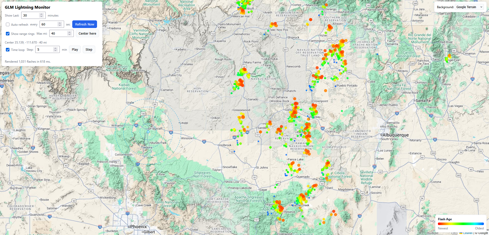

# GLM Lightning Monitor



## Installation

### Requirements
 * [Docker](https://docs.docker.com/engine/install/)

### Build the Container 

```shell
$ git clone https://github.com/HumphreysCarter/GLM-Lightning-Monitor.git
$ cd GLM-Lightning-Monitor
$ docker compose up --build
```

## Usage

Once running, the application will be available at [localhost:8080](http://localhost:8080/). API documentation is available at [localhost:8080/api/docs](http://localhost:8080/api/docs).